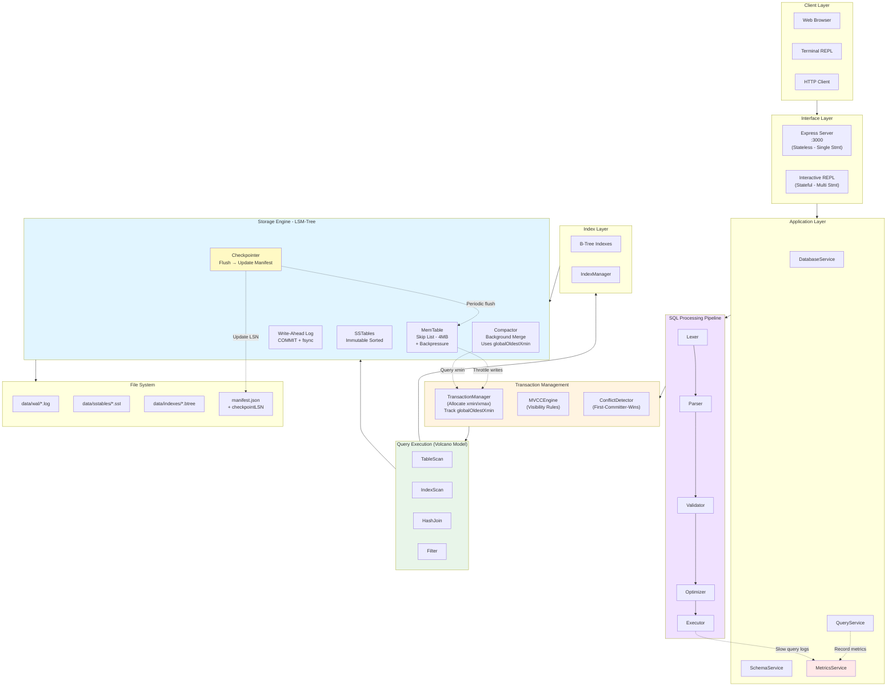

# Enterprise RDBMS Prototype

A single-node relational database prototype demonstrating transaction processing, MVCC visibility rules, and WAL-based crash recovery.

## Purpose

This project exists to demonstrate database internals and systems engineering judgment. It prioritizes **correctness**, **failure semantics**, and **trade-off clarity** over performance or feature completeness.

**This is not production software.** It is a learning artifact designed to make database internals explicit, reviewable, and testable.

## What This Demonstrates

- **Snapshot isolation** via Postgres-style MVCC (xmin/xmax versioning)
- **First-committer-wins** conflict detection for concurrent writes
- **Write-ahead logging** with crash recovery and replay
- **LSM-Tree storage** with compaction and MVCC garbage collection
- **Volcano-style query execution** with operator pipelining
- **B-Tree indexing** with MVCC semantics

## Explicit Non-Goals

- Serializable isolation (allows write skew by design)
- Distributed replication or consensus
- Production performance guarantees
- Online schema migration
- Adaptive query optimization

## Architecture Overview



## Key Design Decisions

| Decision                             | Rationale                                 | Trade-off                 |
| ------------------------------------ | ----------------------------------------- | ------------------------- |
| Snapshot isolation over serializable | Simpler MVCC, demonstrates core mechanics | Allows write skew         |
| Indexes not WAL-logged               | Simpler recovery logic                    | Slower recovery time      |
| LSM-Tree over B-Tree heap            | Write-optimized, modern storage           | Read amplification        |
| Single-threaded execution            | Correctness over performance              | No parallelism            |
| No commit-status table               | Prototype simplification                  | Visibility approximations |

## Documentation

📄 **[Design Documentation](docs/)** — Detailed subsystem designs (MVCC, WAL, LSM, execution)

🧠 **[Design Review Guide](docs/INTERVIEW_GUIDE.md)** — Common discussion points and reasoning

⚠️ **[Known Limitations](docs/LIMITATIONS.md)** — Explicit correctness gaps

⚖️ **[Trade-offs](docs/TRADEOFFS.md)** — Design decision rationale

## Quick Start

```bash
# Install dependencies
npm install

# Run tests
npm test

# Start REPL
npm start

# Start REST API
npm run server
```

## Example Session

```sql
db> BEGIN;
Transaction started (xmin=100)

db> CREATE TABLE users (id INT PRIMARY KEY, name VARCHAR, age INT);
Table created

db> INSERT INTO users VALUES (1, 'Alice', 30);
1 row inserted

db> CREATE INDEX idx_age ON users(age);
Index created

db> SELECT * FROM users WHERE age > 25;
+----+-------+-----+
| id | name  | age |
+----+-------+-----+
| 1  | Alice | 30  |
+----+-------+-----+

db> COMMIT;
Transaction committed
```

## Testing

```bash
npm test                    # All tests
npm run test:unit           # Unit tests (MVCC, WAL, storage)
npm run test:integration    # Integration tests (recovery, concurrency)
npm run test:coverage       # Coverage report
```

## Project Status

**Current:** Phase 2 complete (WAL + Recovery)  
**Next:** Phase 3 (LSM-Tree compaction)

## Author Notes

This project demonstrates senior-level understanding of:

- Transaction isolation semantics and MVCC visibility rules
- Write-ahead logging and crash recovery protocols
- Storage engine internals and compaction strategies
- Query optimization and execution models

It intentionally omits features that would obscure the core algorithms (e.g., distributed replication, adaptive optimization, connection pooling).

## License

MIT — Educational purposes
