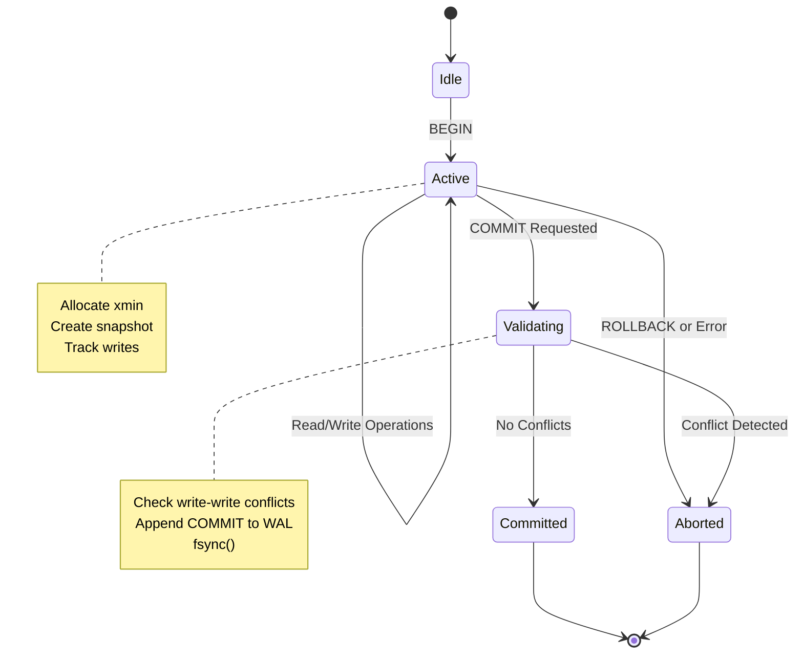

# MVCC & Snapshot Isolation

This document describes the multi-version concurrency control (MVCC) implementation, snapshot isolation semantics, and conflict detection strategy.

---

## Overview

We implement **Postgres-style MVCC** with:

- **xmin/xmax** versioning on every row
- **Snapshot isolation** (not serializable)
- **First-committer-wins** conflict detection
- **Optimistic concurrency** (no read locks)

---

## Snapshot Structure

A snapshot captures the state of the database at a point in time:

```typescript
interface Snapshot {
  xmin: number; // Oldest active transaction when snapshot was taken
  xmax: number; // Next transaction ID to be assigned
  activeTxns: Set<number>; // Transactions that were active at snapshot time
}
```

**Semantics:**

- Transactions with ID < `xmin` → committed before snapshot
- Transactions with ID >= `xmax` → started after snapshot
- Transactions in `activeTxns` → were in progress at snapshot time

---

## Row Versioning

Every row carries MVCC metadata:

```typescript
interface VersionedRow {
  key: string;
  data: Record<string, any>;
  xmin: number; // Creating transaction ID
  xmax: number | null; // Deleting transaction ID (null = not deleted)
}
```

**Lifecycle:**

1. **INSERT:** Creates row with `xmin = current_txn_id`, `xmax = null`
2. **DELETE:** Sets `xmax = current_txn_id` (doesn't physically remove)
3. **UPDATE:** Equivalent to DELETE old + INSERT new
4. **Garbage collection:** Removes rows where `xmax < globalOldestXmin`

---

## Visibility Rules (CRITICAL: Rule Ordering Matters)

```typescript
function isVisible(row: VersionedRow, snapshot: Snapshot): boolean {
  // Rule 1: Created by active txn → invisible
  // MUST CHECK FIRST - a txn can be active even if xmin < snapshot.xmax
  if (snapshot.activeTxns.has(row.xmin)) {
    return false;
  }

  // Rule 2: Created after snapshot → invisible
  if (row.xmin >= snapshot.xmax) {
    return false;
  }

  // Rule 3: Not deleted → visible
  if (row.xmax === null) {
    return true;
  }

  // Rule 4: Deleted before snapshot → invisible
  if (row.xmax < snapshot.xmin) {
    return false;
  }

  // Rule 5: Deleted by active txn → still visible
  if (snapshot.activeTxns.has(row.xmax)) {
    return true;
  }

  // Rule 6: Deleted after snapshot → visible
  // LIMITATION: Approximation via txn ID ordering
  return row.xmax >= snapshot.xmax;
}
```

### Why Rule Ordering Matters

**Incorrect order (checking xmin comparison before active set):**

```typescript
// ❌ WRONG
if (row.xmin >= snapshot.xmax) return false; // Checked FIRST
if (snapshot.activeTxns.has(row.xmin)) return false;

// Breaks this scenario:
// - T100 is active, xmin=100
// - snapshot.xmax=105
// - T100.xmin (100) < snapshot.xmax (105) → passes first check
// - Row becomes visible INCORRECTLY
```

**Correct order:**

```typescript
// ✅ CORRECT
if (snapshot.activeTxns.has(row.xmin)) return false; // Checked FIRST
if (row.xmin >= snapshot.xmax) return false;
```

---

## Conflict Detection (First-Committer-Wins)

We detect **write-write conflicts** to implement snapshot isolation:

```typescript
function checkConflicts(txn: Transaction): boolean {
  for (const [key, newVersion] of txn.getWrites()) {
    const currentRow = storage.get(key);

    if (!currentRow) continue; // New insert, no conflict

    // Conflict if:
    // 1. Another transaction (not us) created a version
    // 2. That version was created at/after our snapshot
    // 3. That transaction committed (not in our active set)
    if (
      currentRow.xmin !== txn.id &&
      currentRow.xmin >= txn.snapshot.xmax &&
      !txn.snapshot.activeTxns.has(currentRow.xmin)
    ) {
      return true; // First-committer-wins violation
    }
  }

  return false;
}
```

### What This Detects

✅ **Prevents:**

- Lost updates (write-write conflicts)
- Dirty writes

❌ **Allows (by design):**

- Write skew (see below)
- Phantom reads (at SI level)

### Write Skew Example (Allowed Under SI)

```sql
-- Constraint: SUM(balance) >= 0

-- T1: snapshot = {xmin:100, xmax:101}
SELECT SUM(balance) FROM accounts; -- Returns 200
UPDATE accounts SET balance = balance - 150 WHERE id = 'A';

-- T2: snapshot = {xmin:100, xmax:102}
SELECT SUM(balance) FROM accounts; -- Returns 200
UPDATE accounts SET balance = balance - 150 WHERE id = 'B';

-- Both commit successfully (no write-write conflict)
-- Final state: A=-50, B=-50, Total=-100 (violates constraint!)
```

**Why this happens:**

- T1 and T2 write to **different rows** (no write-write conflict)
- Each saw a consistent snapshot (no dirty reads)
- But the constraint check happened on stale data

**Mitigation:**

1. Application-level locking: `SELECT FOR UPDATE`
2. Serializable isolation: SSI with predicate locks
3. Materialized constraints: Store aggregate in a single row

---

## Known Limitations

### 1. No Commit-Status Table (pg_xact)

**Issue:** Deletion visibility (Rule 6) approximates using transaction ID ordering.

**Problem scenario:**

```
1. T10 deletes row (xmax=10)
2. T10 aborts
3. Snapshot with xmax=20 starts
4. Our logic: xmax (10) < snapshot.xmax (20) → invisible
5. WRONG: Row should be visible (delete was aborted)
```

**Production solution:** Maintain a commit-status table:

```typescript
enum TxnStatus {
  COMMITTED,
  ABORTED,
  IN_PROGRESS,
}
const commitStatus: Map<number, TxnStatus>;

// In visibility check:
if (commitStatus.get(row.xmax) === TxnStatus.ABORTED) {
  return true; // Deletion was aborted, row is visible
}
```

### 2. No Write Skew Prevention

Snapshot isolation allows write skew. Moving to **serializable** requires:

**Option A: Serializable Snapshot Isolation (SSI)**

- Track read/write dependencies
- Detect dangerous structures (rw-antidependency cycles)
- Abort one transaction in cycle

**Option B: Predicate Locking**

- Lock ranges, not just rows
- More conservative, higher overhead

### 3. Row-Level Granularity Only

We don't track:

- Predicate locks (for range queries)
- Table-level locks
- Intent locks on deleted rows

This can cause anomalies in concurrent delete scenarios.

---

## Transaction State Machine



---

## Testing Strategy

### Unit Tests

```typescript
describe("MVCC Visibility", () => {
  test("Rule 1: Active txn invisible", () => {
    const row = { xmin: 100, xmax: null };
    const snapshot = { xmin: 95, xmax: 105, activeTxns: new Set([100]) };
    expect(isVisible(row, snapshot)).toBe(false);
  });

  test("Rule ordering: Active check before xmax", () => {
    const row = { xmin: 100, xmax: null };
    const snapshot = { xmin: 95, xmax: 110, activeTxns: new Set([100]) };
    // T100 is active even though 100 < 110
    expect(isVisible(row, snapshot)).toBe(false);
  });

  test("Deleted row invisible if deleter committed before snapshot", () => {
    const row = { xmin: 50, xmax: 90 };
    const snapshot = { xmin: 95, xmax: 100, activeTxns: new Set() };
    expect(isVisible(row, snapshot)).toBe(false);
  });
});
```

### Integration Tests

```typescript
describe("Concurrent Transactions", () => {
  test("Write-write conflict detection", async () => {
    const t1 = db.begin();
    const t2 = db.begin();

    await db.execute('UPDATE users SET name="Alice" WHERE id=1', t1);
    await db.execute('UPDATE users SET name="Bob" WHERE id=1', t2);

    await db.commit(t1); // Should succeed
    await expect(db.commit(t2)).rejects.toThrow("Write-write conflict");
  });
});
```

---

## Comparison to Other Systems

| System                      | Isolation Level | Conflict Detection    | Write Skew |
| --------------------------- | --------------- | --------------------- | ---------- |
| **This prototype**          | Snapshot        | First-committer-wins  | Allowed    |
| **Postgres (default)**      | Read Committed  | Per-statement         | Allowed    |
| **Postgres (SERIALIZABLE)** | Serializable    | SSI                   | Prevented  |
| **MySQL InnoDB**            | Repeatable Read | Next-key locks        | Prevented  |
| **Oracle**                  | Read Committed  | Multi-version + locks | Allowed    |

---

## References

- [A Critique of ANSI SQL Isolation Levels](https://www.microsoft.com/en-us/research/publication/a-critique-of-ansi-sql-isolation-levels/) (Berenson et al., 1995)
- [Serializable Snapshot Isolation](https://courses.cs.washington.edu/courses/cse444/08au/544M/READING-LIST/fekete-sigmod2008.pdf) (Cahill et al., 2008)
- [Postgres MVCC Documentation](https://www.postgresql.org/docs/current/mvcc.html)
